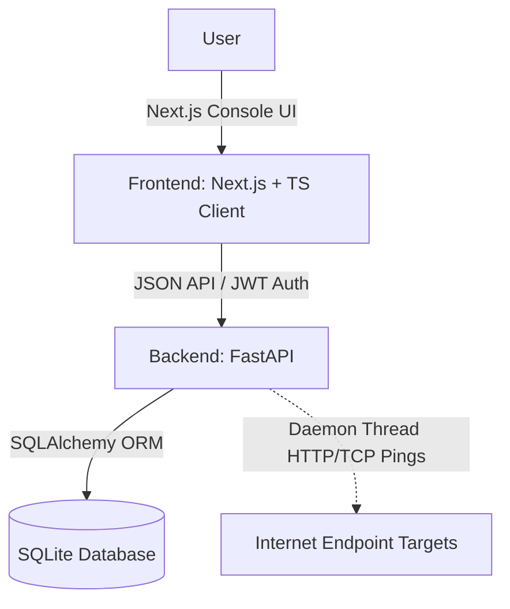

# AWS Route53 Console Clone

A high-fidelity functional clone of the **Amazon Web Services (AWS) Route 53** cloud DNS web application console. This project recreates the authentic navigation structures, hosted zone management controls, DNS resolver options, compliance profile pages, and routing/failover sandboxes using a persistent database state.

---

## 🏗️ Architecture Design & Tech Stack



### Stack Components:
1. **Frontend**: Next.js App Router written in TypeScript, using Tailwind/Vanilla CSS for AWS HSL/Dark slate themed components, and Lucide React icons.
2. **Backend**: FastAPI (Python) backend providing modular JWT Authentication, CRUD endpoints, and asynchronous testing paths.
3. **Database**: Persistent SQLite engine managed using SQLAlchemy schemas.
4. **Daemon Threads**: Monitored health checks are periodically verified by an integrated background probe thread.

---

## 🚀 Quick Setup Instructions

### Backend Setup
1. Navigate to the `backend` directory:
   ```bash
   cd backend
   ```
2. Activate your virtual environment and install dependency modules:
   ```bash
   # On Windows Power Shell:
   ..\.venv\Scripts\activate
   # Or install via python pip:
   pip install -r requirements.txt
   ```
3. Boot up the FastAPI reload server:
   ```bash
   python -m uvicorn app.main:app --port 8000 --reload
   ```
   *The backend documentation is hosted dynamically at `http://localhost:8000/docs`.*

### Frontend Setup
1. Navigate to the `frontend` directory:
   ```bash
   cd frontend
   ```
2. Install npm package dependencies:
   ```bash
   npm install
   ```
3. Run the hot-reloading Next.js dev server:
   ```bash
   npm run dev
   ```
   *Open [http://localhost:3000](http://localhost:3000) inside your web browser. Default mock login coordinates can be created via the register drawer directly.*

---

## 🗄️ Database Schemas (SQLite Mapping)

The application structures four primary entities: `users`, `hosted_zones`, `dns_records`, and `health_checks`.

### 1. `users` Table
Stores login user accounts.
| Column | Type | Attributes | Description |
| :--- | :--- | :--- | :--- |
| `id` | INTEGER | PRIMARY KEY | Unique index ID |
| `username` | VARCHAR | UNIQUE, INDEX | IAM login username |
| `hashed_password` | VARCHAR | NOT NULL | Secure HMAC-SHA256 PBKDF2 salted hash (100,000 iterations) |
| `created_at` | DATETIME | DEFAULT current_time | Registration registry timestamp |

### 2. `hosted_zones` Table
Maps distinct domain DNS Hosted Zone registries.
| Column | Type | Attributes | Description |
| :--- | :--- | :--- | :--- |
| `id` | VARCHAR | PRIMARY KEY | Route53 Zone ID format, e.g. `Z0123456789ABC` |
| `name` | VARCHAR | INDEX, NOT NULL | Normalized zone domain, e.g. `mywebsite.com.` |
| `type` | VARCHAR | Default `"Public"` | `"Public"` or `"Private"` zoning |
| `description` | VARCHAR | Nullable | Optional domain tags |
| `comment` | VARCHAR | Nullable | Custom comments |
| `vpc_id` | VARCHAR | Nullable | Linked VPC association for Private zones |
| `vpc_region` | VARCHAR | Nullable | Linked VPC Region |
| `record_count` | INTEGER | Default `2` | Number of active DNS records (Starts with default NS + SOA) |

### 3. `dns_records` Table
Stores customized zone records. Supports Simple, Weighted, Geolocation, Latency, and Failover routing.
| Column | Type | Attributes | Description |
| :--- | :--- | :--- | :--- |
| `id` | VARCHAR | PRIMARY KEY | UUID record ID |
| `hosted_zone_id` | VARCHAR | FOREIGN KEY, Cascade | Linked parent `hosted_zones.id` |
| `name` | VARCHAR | INDEX | Record prefix address, e.g. `www.mywebsite.com.` |
| `type` | VARCHAR | NOT NULL | Type matching (`A`, `AAAA`, `CNAME`, `TXT`, `MX`, `NS`, `PTR`, `SRV`, `CAA`) |
| `value` | VARCHAR | NOT NULL | Endpoints target list (multiline values supported) |
| `ttl` | INTEGER | Default `300` | Time To Live duration in seconds |
| `routing_policy` | VARCHAR | Default `"Simple"` | Routing policy type (`Simple`, `Weighted`, `Geolocation`, `Failover`, `Latency`) |
| `weight` | INTEGER | Nullable | Weighted index ratio |
| `region` | VARCHAR | Nullable | Geolocation country/state/regional target |
| `failover_status`| VARCHAR | Nullable | Failover mapping (`Primary` or `Secondary`) |
| `health_check_id`| VARCHAR | Nullable | Associated `health_checks.id` target |

### 4. `health_checks` Table
Monitors target status to coordinate Failover and route queries dynamically.
| Column | Type | Attributes | Description |
| :--- | :--- | :--- | :--- |
| `id` | VARCHAR | PRIMARY KEY | Route53 Health Check ID, e.g. `hc-abcdef0123` |
| `name` | VARCHAR | NOT NULL | Custom health check name |
| `type` | VARCHAR | Default `"ENDPOINT"` | Monitor type |
| `ip_address` | VARCHAR | Nullable | Monitored IP server |
| `domain_name` | VARCHAR | Nullable | Monitored domain hostname |
| `protocol` | VARCHAR | Default `"HTTP"` | Protocol matching (`HTTP`, `HTTPS`, `TCP`) |
| `port` | INTEGER | Default `80` | Network port monitored |
| `path` | VARCHAR | Default `"/"` | Checker target URL path |
| `status` | VARCHAR | Default `"Healthy"` | Live status state (`Healthy`, `Unhealthy`, `Unknown`) |

---

## 🔌 API Interface Endpoint Summary

### 🔑 Authentication
* `POST /api/auth/register` - Create a new user profile.
* `POST /api/auth/login` - Authenticate account and receive JWT access keys.
* `GET /api/auth/me` - Fetch details of active authenticated user.

### 🌐 Hosted Zones
* `GET /api/hosted-zones` - Query hosted zones with support for search filters.
* `POST /api/hosted-zones` - Initialize a public/private hosted zone (automatically creates NS and SOA records).
* `GET /api/hosted-zones/{id}` - Fetch hosted zone specifications, including all DNS records.
* `PUT /api/hosted-zones/{id}` - Edit hosted zone properties.
* `DELETE /api/hosted-zones/{id}` - Delete zones (cascades records deletion).

### 📋 DNS Records
* `GET /api/hosted-zones/{zone_id}/records` - Fetch record sets with filters.
* `POST /api/hosted-zones/{zone_id}/records` - Create new records inside a hosted zone.
* `PUT /api/records/{id}` - Modify details for a specific DNS record.
* `DELETE /api/records/{id}` - Delete a single DNS record.
* `POST /api/records/bulk-delete` - Delete multiple DNS records simultaneously.

### 📂 Zone Import & Export
* `POST /api/hosted-zones/{zone_id}/import` - Import raw BIND zone text or upload file to parse and sync records.
* `GET /api/hosted-zones/{zone_id}/export` - Export records list in standard BIND or JSON configurations.

### 🩺 Health Checks & Live Testing
* `GET /api/health-checks` - Query health checks.
* `POST /api/health-checks` - Configure new HTTP/HTTPS/TCP health checks.
* `DELETE /api/health-checks/{id}` - Delete health checks.
* `POST /api/health-checks/{id}/toggle` - Manually toggle status to inspect routing behaviors.
* `GET /api/hosted-zones/{zone_id}/test-dns-answer` - Test query resolver logic under geolocation filters or failovers.
* `GET /api/health-checks/test-probe` - Perform real-time probes on external targets, testing HTTP 3xx standard compliance without following redirects.

---

## 🛠️ Workflows & Evaluation Standards

This project fulfills all criteria specified in the Route 53 Clone assignment instructions:
* **Route 53 Look and Feel**: Recreated with CSS layouts matching the true AWS console layout (breadcrumb navigation, sidebar structure, AWS table styles, search boxes, record edit forms).
* **Database Persisted CRUD**: Both zones and records persist correctly inside the SQLite database.
* **BIND Import/Export**: Fully functional zone file import parser and exporter.
* **Complex Routing Simulator**: Features active geolocation routing fallback and failover paths that respond immediately to health check probe statuses.
